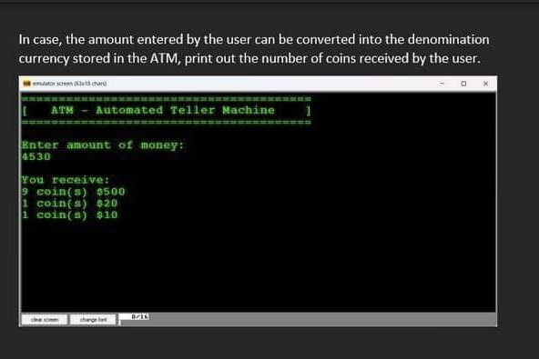
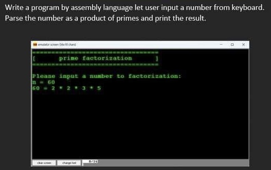
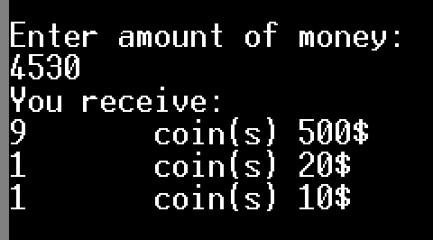
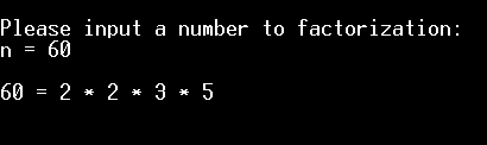
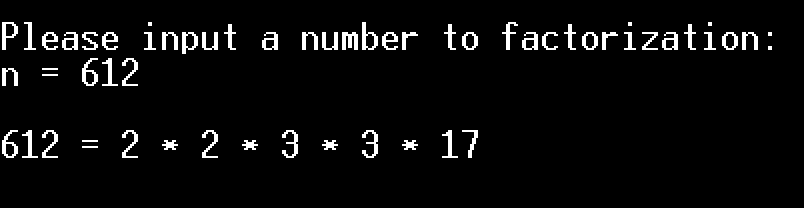

# 1. BT
## 1.1. ATM


## 1.2. Find Prime Factor of a number


# 2. Code
## 3.1 ATM
``` asm
.model small
.stack 100
.data
    ; 09: tab   13, 10: endline    '$': endstring
    ENDLINE          db 13, 10, '$'
    MSG_INPUT        db 13, 10, "Enter amount of money:", 13, 10, '$'
    MSG_NOT_A_NUMBER db 13, 10, "Please input valid number 0-9...", 13, 10, '$'
    MSG_INVALID      db 13, 10, "Invalid value, Please enter a number that is a mutiple of 10.", 13, 10, '$'
    willdrawn_amount dw 0
    coin_10          dw 0
    coin_20          dw 0
    coin_50          dw 0
    coin_100         dw 0
    coin_200         dw 0
    coin_500         dw 0
    MSG_COIN         db 13, 10, "You receive:", 13, 10, '$'
    MSG_COIN_INFO    db 09, "coin(s)", 09, '$'
    MSG_COIN_10      db "10", '$'
    MSG_COIN_20      db "20", '$'
    MSG_COIN_50      db "50", '$'
    MSG_COIN_100     db "100", '$'
    MSG_COIN_200     db "200", '$'
    MSG_COIN_500     db "500", '$'
.code
main proc
                  mov  ax, @data
                  mov  ds, ax
    ; Input
                  call inputDec
    ; Output
                  mov  ax, willdrawn_amount
                  call outputDec

    ; Turn into coins
                  call turnIntoCoins
    ; Terminate program
                  mov  ah, 4ch
                  int  21h
main endp

    ; Print the dollar sign and endline
dollarSign proc
                  MOV  DL, '$'                 ; $
                  MOV  AH, 2
                  INT  21H

                  lea  dx, ENDLINE             ; Endline
                  mov  ah, 9
                  int  21h
                  ret
dollarSign endp


    ; Store input value from keyboard into willdrawn_amount
inputDec proc
    ; Push all registers
                  push ax
                  push bx
                  push cx
                  push dx
         
    beginInput:   
    ; mov  ah, 2
                  lea  dx, MSG_INPUT           ; Show input msg
                  mov  ah, 9
                  int  21h

                  xor  bx, bx                  ; Temp SUM
                  xor  cx, cx
                  mov  ah, 1
                  int  21h
    continueInput:
    ; Begin Condition for a number: '0' <= input char value (al) <= '9'
                  cmp  al, '0'
                  jnge notANumber
                  cmp  al, '9'
                  jnle notANumber
    ; End Condition for a number: '0' <= input char value (al) <= '9'

    ; Begin Converting input char value into Dec value
                  and  ax, 000fh               ; Store char value in AX instead of AL
                  push ax                      ; Push char value
                  mov  ax, 10                  ; AX = 10 (For decimal conversion)
                 
                  mul  bx                      ; AX = AX * BX = 10 * SUM
                  mov  bx, ax                  ; BX = AX
                  pop  ax                      ; Pop char value
                  add  bx, ax                  ; BX = 10 * BX + AX
    ; Begin Check End Input condition (Enter)
                  mov  ah, 1
                  int  21h
                  cmp  al, 13                  ; if(input != ENTER)
                  jne  continueInput           ;    continueInput
    ; End Check End Input condition (Enter)
    ; Begin Check if willdrawn_amount is a valid (%10 = 0 is valid)
                  mov  ax, bx                  ; AX = BX
                  mov  cx, 10                  ; AX = AX / CX = BX / 10; DX = AX % CX = BX % 10
                  div  cx
                  cmp  dx, 0                   ; Check DX = BX % 10 = 0
                  jne  invalid
    ; End Check if willdrawn_amount is a valid (%10 = 0 is valid)
    ; End Converting input char value into Dec value

    doneInput:    
    ; Store coverted value into willdrawn_amount
                  mov  willdrawn_amount, bx
    ; Pop all registers
                  pop  dx
                  pop  cx
                  pop  bx
                  pop  ax
    ; return proc
                  ret
                 
    notANumber:   
    ; Begin Not a number error message
                  lea  dx, MSG_NOT_A_NUMBER
                  mov  ah, 9
                  int  21h
    ; End Not a number error message
                  jmp  beginInput              ; Input again
    
    invalid:      
    ; Begin Invalid error message
                  lea  dx, MSG_INVALID
                  mov  ah, 9
                  int  21h
    ; End Invalid number error message
                  jmp  beginInput              ; Input again
inputDec endp

    ; Turn willdrawn_amount into coin_500, coin_200,... coin_10
turnIntoCoins proc
    ; Push all registers
                  push ax
                  push bx
                  push cx
                  push dx

    ; BX = coin value; coins AX = willdrawn_amount / coin value; remained money DX = willdrawn_amount % coin value
                
                  mov  ax, willdrawn_amount    ; AX = willdrawn_amount
                  xor  dx, dx                  ; Remainder dx = 0
                  mov  bx, 500                 ; 500$ coin value
                  div  bx
                  mov  coin_500, ax            ; number of 500$ coins

                  mov  ax, dx
                  xor  dx, dx
                  mov  bx, 200                 ; 200$ coin value
                  div  bx
                  mov  coin_200, ax            ; number of 200$ coins

                  mov  ax, dx
                  xor  dx, dx
                  mov  bx, 100                 ; 100$ coin value
                  div  bx
                  mov  coin_100, ax            ; number of 100$ coins

                  mov  ax, dx
                  xor  dx, dx
                  mov  bx, 50                  ; 50$ coin value
                  div  bx
                  mov  coin_50, ax             ; number of 50$ coins

                  mov  ax, dx
                  xor  dx, dx
                  mov  bx, 20                  ; 20$ coin value
                  div  bx
                  mov  coin_20, ax             ; number of 20$ coins

                  mov  ax, dx
                  xor  dx, dx
                  mov  bx, 10                  ; 10$ coin value
                  div  bx
                  mov  coin_10, ax             ; number of 10$ coins

    ; Print all coins
                  lea  dx, MSG_COIN            ; Show Coin MSG
                  mov  ah, 9
                  int  21h
    print_500:    
                  cmp  coin_500, 0
                  je   print_200               ; Skip print if no coins avaiable
                  mov  ax, coin_500            ; AX = 500 coins
                  call outputDec               ; print Dec value in AX
                  lea  dx, MSG_COIN_INFO       ; Show Coin MSG
                  mov  ah, 9
                  int  21h
                  lea  dx, MSG_COIN_500        ; Show '500;
                  mov  ah, 9
                  int  21h
                  call dollarSign              ; Show '$\n'
    
    print_200:    
                  cmp  coin_200, 0
                  je   print_100               ; Skip print if no coins avaiable
                  mov  ax, coin_200            ; AX = 200 coins
                  call outputDec               ; print Dec value in AX
                  lea  dx, MSG_COIN_INFO       ; Show Coin MSG
                  mov  ah, 9
                  int  21h
                  lea  dx, MSG_COIN_200        ; Show '200;
                  mov  ah, 9
                  int  21h
                  call dollarSign              ; Show '$\n'

    print_100:    
                  cmp  coin_100, 0
                  je   print_50                ; Skip print if no coins avaiable
                  mov  ax, coin_100            ; AX = 100 coins
                  call outputDec               ; print Dec value in AX
                  lea  dx, MSG_COIN_INFO       ; Show Coin MSG
                  mov  ah, 9
                  int  21h
                  lea  dx, MSG_COIN_100        ; Show '100;
                  mov  ah, 9
                  int  21h
                  call dollarSign              ; Show '$\n'

    print_50:     
                  cmp  coin_50, 0
                  je   print_20                ; Skip print if no coins avaiable
                  mov  ax, coin_50             ; AX = 50 coins
                  call outputDec               ; print Dec value in AX
                  lea  dx, MSG_COIN_INFO       ; Show Coin MSG
                  mov  ah, 9
                  int  21h
                  lea  dx, MSG_COIN_50         ; Show '50;
                  mov  ah, 9
                  int  21h
                  call dollarSign              ; Show '$\n'

    print_20:     
                  cmp  coin_20, 0
                  je   print_10                ; Skip print if no coins avaiable
                  mov  ax, coin_20             ; AX = 20 coins
                  call outputDec               ; print Dec value in AX
                  lea  dx, MSG_COIN_INFO       ; Show Coin MSG
                  mov  ah, 9
                  int  21h
                  lea  dx, MSG_COIN_20         ; Show '20;
                  mov  ah, 9
                  int  21h
                  call dollarSign              ; Show '$\n'

    print_10:     
                  cmp  coin_10, 0
                  je   print_end               ; Skip print if no coins avaiable
                  mov  ax, coin_10             ; AX = 10 coins
                  call outputDec               ; print Dec value in AX
                  lea  dx, MSG_COIN_INFO       ; Show Coin MSG
                  mov  ah, 9
                  int  21h
                  lea  dx, MSG_COIN_10         ; Show '10;
                  mov  ah, 9
                  int  21h
                  call dollarSign              ; Show '$\n'
                
    print_end:    
    ; Pop all registers
                  pop  dx
                  pop  cx
                  pop  bx
                  pop  ax
    ; return proc
                  ret
turnIntoCoins endp
     
    ; Print ax to screen
outputDec proc
    ; Push all registers
                  push ax
                  push bx
                  push cx
                  push dx

                  xor  cx, cx                  ; cx = 0 (digit index)
                  mov  bx, 10                  ; bx = 10 (divisor factor)
    divide:       
                  xor  dx, dx                  ; dx = 0
                  div  bx                      ; quotient ax = ax / bx; remainder dx = ax % bx
                  push dx
                  inc  cx
                  cmp  ax, 0                   ; if(remainder != 0)
                  jne  divide                  ;    divide
                  mov  ah, 2
    show:         
                  pop  dx
                  or   dl, 30h
                  int  21h
                  loop show
    ; Pop all registers
                  pop  dx
                  pop  cx
                  pop  bx
                  pop  ax
    ; return proc
                  ret
         
outputDec endp
     
end main
```
## 2.2. Find Prime Factor of a number
``` asm
.model small
.stack 100
.data
    ; 09: tab   13, 10: endline    '$': endstring
    ENDLINE          db 13, 10, '$'
    ENDLINE_x2       db 13, 10, 13, 10, '$'
    MSG_INPUT        db 13, 10, "Please input a number to factorization:", 13, 10, "n = ", '$'
    MSG_OUTPUT       db " = ", '$'
    MSG_NOT_A_NUMBER db 13, 10, "Please input valid number 0-9...", 13, 10, '$'
    MSG_SPACING      db " * ", '$'
    n                dw 0
    n_half           dw 0
.code
main proc
                             mov  ax, @data
                             mov  ds, ax
    ; Input into n
                             call inputDec
    ; Print all prime factors of n
                             call printPrimeFactors
main endp

    ; Print prime factors of n
printPrimeFactors proc
    ; Push all registers
                             push ax
                             push bx
                             push cx
                             push dx
    ; Start finding prime factors
                             lea  dx, ENDLINE_x2
                             mov  ah, 9
                             int  21h

                             mov  ax, n                       ; AX = n, to be devived by 2
                             call outputDec
                             push ax
                             push dx
                             lea  dx, MSG_OUTPUT
                             mov  ah, 9
                             int  21h
                             pop  dx
                             pop  ax
                             mov  cx, n                       ; Holder of n before n/2
                             xor  dx, dx                      ; Remainder = 0
                             mov  bx, 2                       ; Devider = 2
    ; AX = n. We start looping AX/2 untill remainder != 0, so now AX is an odd number
    
    ; Begin div 2
    div_by2:                 
                             mov  cx, ax                      ; Temp holder of n before AX/2
                             div  bx                          ; AX = AX/2; DX = AX%2
    ; check end condition
                             cmp  dx, 0
                             jne  done_div_by2
    ; print bx
                             push ax
                             push dx

                             mov  ax, bx
                             call outputDec

                             lea  dx, MSG_SPACING
                             mov  ah, 9
                             int  21h

                             pop  dx
                             pop  ax
    ; loop back
                             jmp  div_by2
    done_div_by2:            
                             mov  ax, cx                      ; AX%2 != 0 => get back the holder value into AX
    ; End div 2

    ; init variables
                             mov  bx, 1                       ; Devider = 1
    loopFindPrimeFactors:    
    ; inc BX by 2 and begin new loop
                             add  bx, 2                       ; Devider += 2
    ; check loop end condition: BX > n/2
                             cmp  bx, n_half
                             jg   END_loopFindPrimeFactors
    ; Begin loop body
                             xor  dx, dx                      ; Remainder = 0
    ; Begin div BX
    div_byBX:                
                             mov  cx, ax                      ; Temp holder of AX before AX/BX
                             div  bx                          ; AX = AX/BX; DX = AX%BX
    ; check condition
                             cmp  dx, 0
                             jne  not_div_byBX                ; if AX%BX != 0
    ; else
    ; print bx
                             push ax
                             push dx

                             mov  ax, bx
                             call outputDec

                             lea  dx, MSG_SPACING
                             mov  ah, 9
                             int  21h

                             pop  dx
                             pop  ax
    ; loop back
                             jmp  div_byBX
    not_div_byBX:            
                             mov  ax, cx
                             jmp  loopFindPrimeFactors        ; Loop back
    ; End div BX
    
    ; End loop body
    END_loopFindPrimeFactors:
    ; Delele last Spacing
                             mov  ax, 3
                             call delete
    ; Pop all registers
                             pop  dx
                             pop  cx
                             pop  bx
                             pop  ax
    ; Terminate program
                             mov  ah, 4ch
                             int  21h
printPrimeFactors endp

    ; Store input value from keyboard into willdrawn_amount
inputDec proc
    ; Push all registers
                             push ax
                             push bx
                             push cx
                             push dx
         
    beginInput:              
    ; mov  ah, 2
                             lea  dx, MSG_INPUT               ; Show input msg
                             mov  ah, 9
                             int  21h

                             xor  bx, bx                      ; Temp SUM
                             xor  cx, cx
                             mov  ah, 1
                             int  21h
    continueInput:           
    ; Begin Condition for a number: '0' <= input char value (al) <= '9'
                             cmp  al, '0'
                             jnge notANumber
                             cmp  al, '9'
                             jnle notANumber
    ; End Condition for a number: '0' <= input char value (al) <= '9'

    ; Begin Converting input char value into Dec value
                             and  ax, 000fh                   ; Store char value in AX instead of AL
                             push ax                          ; Push char value
                             mov  ax, 10                      ; AX = 10 (For decimal conversion)
                 
                             mul  bx                          ; AX = AX * BX = 10 * SUM
                             mov  bx, ax                      ; BX = AX
                             pop  ax                          ; Pop char value
                             add  bx, ax                      ; BX = 10 * BX + AX
    ; Begin Check End Input condition (Enter)
                             mov  ah, 1
                             int  21h
                             cmp  al, 13                      ; if(input != ENTER)
                             jne  continueInput               ;    continueInput
    ; End Check End Input condition (Enter)
    ; End Converting input char value into Dec value
    ; Store coverted value into willdrawn_amount
                             mov  n, bx
                             mov  ax, n
                             mov  bx, 2
                             div  bx
                             mov  n_half, ax
    ; Pop all registers
                             pop  dx
                             pop  cx
                             pop  bx
                             pop  ax
    ; return proc
                             ret
                 
    notANumber:              
                             lea  dx, MSG_NOT_A_NUMBER        ; Not a number error message
                             mov  ah, 9
                             int  21h
                             jmp  beginInput                  ; Input again
inputDec endp

    ; Print ax to screen
outputDec proc
    ; Push all registers
                             push ax
                             push bx
                             push cx
                             push dx

                             xor  cx, cx                      ; cx = 0 (digit index)
                             mov  bx, 10                      ; bx = 10 (divisor factor)
    divide:                  
                             xor  dx, dx                      ; dx = 0
                             div  bx                          ; quotient ax = ax / bx; remainder dx = ax % bx
                             push dx
                             inc  cx
                             cmp  ax, 0                       ; if(remainder != 0)
                             jne  divide                      ;    divide
                             mov  ah, 2
    show:                    
                             pop  dx
                             or   dl, 30h
                             int  21h
                             loop show
    ; Pop all registers
                             pop  dx
                             pop  cx
                             pop  bx
                             pop  ax
    ; return proc
                             ret
         
outputDec endp

    ; Delete back AX char
delete proc
    ; Push all registers
                             push ax
                             push bx
                             push cx
                             push dx

    ; init variables
                             mov  bx, ax
                             mov  cx, bx
    back:                    
    ; Move cursor back one position
                             mov  dl, 8
                             mov  ah, 2
                             int  21h

    ; Loop back
                             loop back
    ; init variables
                             mov  cx, bx
    fill:                    
    ; Fill space char
                             mov  dl, ' '
                             mov  ah, 2
                             int  21h

    ; Loop back
                             loop fill
    ; Pop all registers
                             pop  dx
                             pop  cx
                             pop  bx
                             pop  ax
    ; return proc
                             ret
delete endp
end main
```

# 3. Demo
## 3.1. ATM


## 3.2. Find Prime Factor of a number

